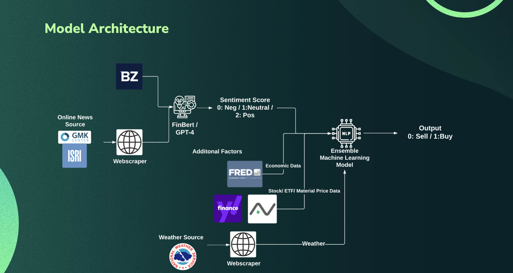
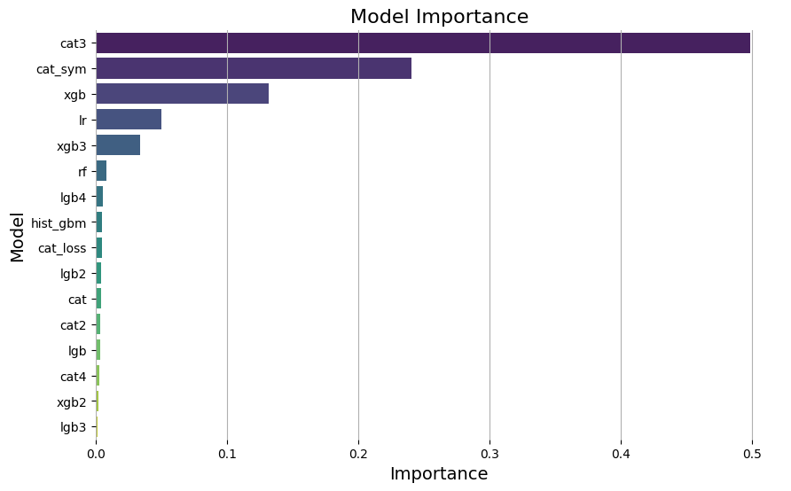

# **Financial News Sentiment Analysis and Directional Price Prediction**

## Overview

This project focuses on analyzing financial news sentiment and utilizing machine learning models to predict stock prices based on the sentiment analysis. It integrates data from various sources, including financial news articles, stock prices, economic indicators, and weather data. The sentiment analysis is performed using two models: FinBert and GPT (Generative Pre-trained Transformer). The machine learning model for price prediction employs the CatBoost algorithm.

Based on the provided project structure and code, it appears to be a comprehensive data pipeline and machine learning project. Here's a description of what the project does:

## Model Architecture


## Project Structure

The project structure is organized as follows:

```
.
├── LICENSE
├── README.md
├── __pycache__
│   ├── ...
├── api-keys.json
├── catboost_info
│   ├── ...
├── data
│   ├── alphavantage
│   │   ├── alphavantage.csv
│   │   ├── economy_macro.csv
│   │   ├── economy_monetary.csv
│   │   ├── energy_transportation.csv
│   │   └── financial_markets.csv
│   ├── benzinga
│   │   ├── AA.csv
│   │   ├── CLF.csv
│   │   ├── ...
│   ├── finbert
│   │   ├── ...
│   ├── fred
│   │   ├── ferrous.csv
│   │   ├── macro.csv
│   │   └── non_ferrous.csv
│   ├── gmk
│   │   └── gmk.csv
│   ├── gpt
│   │   ├── AA.csv
│   │   ├── CLF.csv
│   │   ├── NSC.csv
│   │   ├── NUE.csv
│   │   └── STLD.csv
│   ├── preprocessed
│   │   └── data.csv
│   ├── ready_to_model
│   │   ├── ...
│   ├── sample
│   │   ├── ...
│   ├── target
│   │   └── target_clean.csv
│   ├── weather
│   │   └── weather.csv
│   └── yahoo
│       └── yahoo.csv
├── etl
│   ├── __pycache__
│   │   ├── ...
│   ├── alphavantage.py
│   ├── benzinga.py
│   ├── benzinga_tool
│   │   ├── ...
│   ├── etl.py
│   ├── fred.py
│   ├── gmk.py
│   ├── preprocess
│   │   ├── __pycache__
│   │   │   └── ...
│   │   └── preprocess.py
│   ├── target
│   │   ├── __pycache__
│   │   │   └── ...
│   │   └── target.py
│   ├── weather.py
│   └── yahoofinance.py
├── fe.png
├── finbert.py
├── gpt.py
├── loss.json
├── main.py
└── models
    ├── __pycache__
    │   ├── ...
    ├── catboost_info
    │   ├── ...
    ├── fengineering.py
    ├── ingest.py
    ├── logs.json
    ├── losses.csv
    ├── losses.json
    ├── mlclassifier.py
    ├── ...
```

## Getting Started

To run the project, follow these steps:

1. **Clone the Repository:**
   ```bash
   git clone https://github.com/cristian-leo/financial-sentiment-analysis.git
   cd financial-sentiment-analysis
   ```

2. **Install Dependencies:**
   ```bash
   pip install -r requirements.txt
   ```

3. **Add updated NAT DATABASE.xlsx file**
   Go to data/target and upload the NAT DATABASE.xlsx file. Please make sure it's named in the same way.

3. **Set Up API Keys:**
   Add your API keys to the `api-keys.json` file.

4. **Run the Main Script:**
   ```bash
   python main.py
   ```

## Data Sources

- **Benzinga:** Financial news articles.
- **GPT:** Sentiment analysis using the Generative Pre-trained Transformer.
- **FinBert:** Sentiment analysis using the FinBert model.
- **Yahoo Finance:** Historical stock and ETF prices.
- **FRED:** Federal Reserve Economic Data like total new orders and inventory of scrap metals.
- **AlphaVantage:** Financial market data and sentiment data.
- **Weather:** Weather data.

## **Project Workflow (main.py):**
   - **PullData Class:** A class encapsulating methods for pulling data from various sources.
   - **Update Target:** Updates the target data, potentially serving as a reference or dependent variable for machine learning.
   - **Get Data Method:** Pulls data based on specified flags (e.g., Benzinga, GPT, FinBert, Yahoo, FRED, AlphaVantage, Weather).
   - **Main Execution Block:** Defines the list of tickers, ETFs, and topics, updates the target, pulls data, preprocesses it, and trains the machine learning model.

## Usage

The `main.py` script orchestrates the data pulling process and sentiment analysis. You can customize the tickers, ETFs, topics, and data sources in the script. Additionally, the script includes functionality for updating target data and preprocessing the collected data.

```bash
python main.py
```

## Feature Engineering Methodology
The `FeatureEngineering` class in the machine learning model section appears to be responsible for handling feature engineering tasks, including transformations, clustering, generating new features through arithmetic operations, and selecting the most important features for the final model. Let's break down the key functionalities of this class:

### Initialization:
- The class is initialized with training and testing datasets (`train` and `test`), the name of the target column (`target`), and a list of continuous feature columns (`cont_cols`).

### Transformer:
- Applies multiple transformations (log, square root, Box-Cox, Yeo-Johnson, power transformations) on selected continuous columns.
- Utilizes PCA to reduce dimensionality.
- Trains a Support Vector Classifier (SVC) on each transformed feature and selects the best-performing one based on ROC AUC scores.

### Numerical Clustering:
- Clusters numerical features based on unimportant features obtained from the transformer step.
- Applies KMeans clustering and calculates the ROC AUC score on the transformed data.

### Better Features:
- Generates new columns by applying arithmetic operations on existing ones.
- Selects the best-performing new feature based on ROC AUC scores.

### Main:
- Calls the `better_features` method to perform feature generation and selection.

### Apply Arithmetic Operations:
- Applies specified arithmetic operations on selected feature columns.

### Feature Elimination:
- Eliminates unimportant features based on correlation and clustering.
- Uses PCA for dimensionality reduction.
- Applies KMeans clustering.
- Selects the best-performing transformation for each feature based on ROC AUC scores.

### Scaling:
- Scales selected features in the train and test datasets.

### Post Processor:
- Removes duplicate features after scaling.

### Main Feature Elimination:
- Combines feature elimination, scaling, and post-processing.

### Get Most Important Features:
- Utilizes different models (XGBoost, CatBoost, LightGBM) to obtain the most important features.
- Visualizes the top features.

### Final Selection:
- Performs final feature selection using different models.
- Returns the updated train dataset and a list of selected features.


## Model Methodology

### Classifier Class

The `Classifier` class is designed for defining and initializing multiple classification models. It has the following parameters:

- **n_estimators**: int, default=100, number of estimators for ensemble models.
- **device**: str, default="cpu", device type for CatBoost ("cpu" or "gpu").
- **random_state**: int, default=0, random state for reproducibility.

The `Classifier` class provides the following methods:

1. **\_define_model()**: Define and return a dictionary of classification models.

Here's a brief overview of the models defined in the `Classifier` class:

- **XGBoost Models:**
  - `xgb`: XGBoost classifier with default parameters.
  - `xgb2`: XGBoost classifier with customized parameters.
  - `xgb3`: XGBoost classifier with different customized parameters.

- **LightGBM Models:**
  - `lgb`: LightGBM classifier with default parameters.
  - `lgb2`: LightGBM classifier with customized parameters.
  - `lgb3`: LightGBM classifier with different customized parameters.
  - `lgb4`: Additional LightGBM classifier.

- **CatBoost Models:**
  - `cat`: CatBoost classifier with default parameters.
  - `cat2`, `cat3`, `cat4`: CatBoost classifiers with different customized parameters.
  - `cat_sym`: CatBoost classifier with a symmetric tree grow policy.
  - `cat_loss`: CatBoost classifier with a lossguide tree grow policy.

- **Other Models:**
  - `hist_gbm`: Histogram-based Gradient Boosting Classifier.
  - `lr`: Logistic Regression.
  - `rf`: Random Forest Classifier.

### OptunaWeights Class

The `OptunaWeights` class is designed for optimizing ensemble weights using Optuna. It has the following parameters:

- **random_state**: int, random state for reproducibility.
- **n_trials**: int, default=5000, the number of trials for optimization.

The `OptunaWeights` class provides the following methods:

1. **fit(y_true, y_preds)**: Optimize ensemble weights using Optuna.
2. **predict(y_preds)**: Predict using the optimized ensemble weights.
3. **fit_predict(y_true, y_preds)**: Fit and predict using the optimized ensemble weights.
4. **weights()**: Get the optimized ensemble weights.

### Trainer Class

The `Trainer` class is designed for training and evaluating an ensemble of classification models. It provides the following methods:

1. **save_log(losses, X_train)**: Save the training log to a JSON file.
2. **main(X_train, X_test, y_train, y_test, best_ensemble=False)**: Train and evaluate the ensemble.

Example of usage:

```python
trainer = Trainer()
trainer.main(X_train, X_test, y_train, y_test, best_ensemble=False)
```

The `main` method initializes the base classifiers, trains them on the training data, evaluates their performance on the validation set, and computes ensemble predictions. If `best_ensemble` is set to `True`, it uses Optuna to optimize ensemble weights. The training log is saved to a JSON file.



## Next Steps
Please consider approaching the following next steps to further improve the model:
1. **Automatize the target data ingestion**:  the current project retrieves data from a file provided by DJJ called "NAT DATABASE.xlsx" inside the data/target directory. Therefore, to predict/train an updated dataset, a manual replacement of the dataset is needed.
2. **Activate AlphaVantage with premium API**: AlphaVantage is a leader in the market sentiment space. It provides useful data about general sentiment of companies (Sell, Hold, Buy), and news sentiment.
2. **Daily frequency of predictions**: according to DJJ's request, the model predicts monthly data. However, this present a big limitation, which is the dataset size. The current model ingest data from January 2010 to September 2023, with approximately 200 rows. This results in a very small dataset, which obstacles a high effective training of the model, and adoption of more powerful machine learning solutions.
3. **Integrate results from GMK**: As of now, the project includes a web scraper to retrieve information from GMK. However, the current dataset ranges from 2019 to 2023, the lack of prior data makes it unsuitable for data training. Therefore, the news from GMK are currently not used to train the model. Future implementation, may involve adjusting the webscraper to retrieve older information, or replace the missing information with other sources.
4. **Deep Reinforcement Learning - PPO**: One of the most powerful solutions to predict either the direction of the price or the price itself is leveraging deep reinforcement learning, like PPO. The current project avoid adopting it because it requires a bigger dataset, and it's time and computational expensive.
5. **Retrain the model**: Consider retraining the model every three months, or anytime there is an economic downturn. 

## License

This project is licensed under the [MIT License](LICENSE).

## Acknowledgments

- The project utilizes pre-trained models such as GPT and FinBert.
- CatBoost, a powerful machine learning library.

## Contributing

Feel free to contribute by opening issues or submitting pull requests.

## Authors

- Cristian Leo

## Contact

For inquiries, please contact cl4334@columbia.edu.